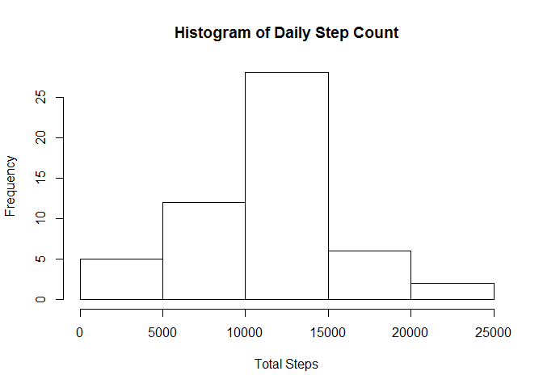
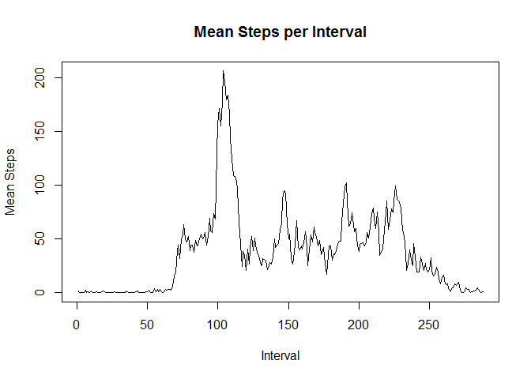
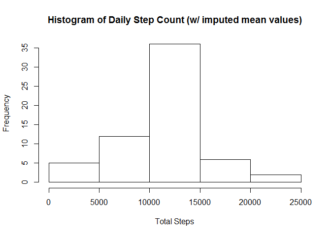
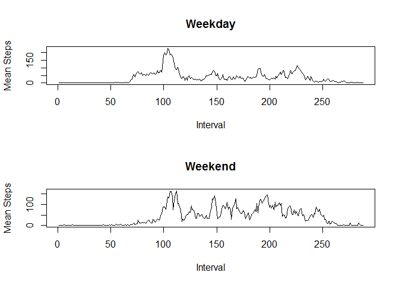

# Reproducible Research: Peer Assessment 1


## Loading and preprocessing the data
This assumes that the project data file, "activity.csv", is located in the working directory.

```r
steps <- read.csv("activity.csv")
library(dplyr)
```

```
## 
## Attaching package: 'dplyr'
## 
## The following object is masked from 'package:stats':
## 
##     filter
## 
## The following objects are masked from 'package:base':
## 
##     intersect, setdiff, setequal, union
```

```r
library(lubridate)
```
A data frame named steps has been created with three columns.  
\$steps is an integer representing the number of steps taken in a specified 5-minute interval.  
\$date is a factor representing the date on which the measurement was taken.  
\$interval is an integer identifying the time of each 5-minute interval in which the measurement was taken. This column will be converted to a factor.

```r
str(steps)
```

```
## 'data.frame':	17568 obs. of  3 variables:
##  $ steps   : int  NA NA NA NA NA NA NA NA NA NA ...
##  $ date    : Factor w/ 61 levels "2012-10-01","2012-10-02",..: 1 1 1 1 1 1 1 1 1 1 ...
##  $ interval: int  0 5 10 15 20 25 30 35 40 45 ...
```

```r
steps$interval <- as.factor(steps$interval)
```
The first few rows hold no surprises. There are some NA values that will need to be worked around.

```r
head(steps)
```

```
##   steps       date interval
## 1    NA 2012-10-01        0
## 2    NA 2012-10-01        5
## 3    NA 2012-10-01       10
## 4    NA 2012-10-01       15
## 5    NA 2012-10-01       20
## 6    NA 2012-10-01       25
```
There are 2304 NA observations out of 17568 total. The maximum 806 steps in a 5-minute interval seems high, 2.7 steps per second for 5 minutes. However, a quick Google check shows that, according to [running.competitor.com](http://running.competitor.com/2014/07/training/make-a-high-stride-rate-work-for-you_54957), "Top-level distance runners typically run at a high number of steps per minute - between 180-200," and "The average recreational runner is closer to 150-170 steps per minute." So this is not an error, merely a measurement of the subject running.

```r
summary(steps)
```

```
##      steps                date          interval    
##  Min.   :  0.00   2012-10-01:  288   0      :   61  
##  1st Qu.:  0.00   2012-10-02:  288   5      :   61  
##  Median :  0.00   2012-10-03:  288   10     :   61  
##  Mean   : 37.38   2012-10-04:  288   15     :   61  
##  3rd Qu.: 12.00   2012-10-05:  288   20     :   61  
##  Max.   :806.00   2012-10-06:  288   25     :   61  
##  NA's   :2304     (Other)   :15840   (Other):17202
```

## What is the mean total number of steps taken per day?
Here we create a summary data frame showing the sum and mean number of steps taken per day. Eight days have summary values of NA. For each of those days, there are no step measurements for any 5-minute period.

```r
stepsDay <- steps %>% group_by(date) %>% summarise_each(funs(sum,mean,median),steps)
stepsDay[is.na(stepsDay$sum) | is.na(stepsDay$mean) | is.na(stepsDay$median),]
```

```
## Source: local data frame [8 x 4]
## 
##         date sum mean median
## 1 2012-10-01  NA   NA     NA
## 2 2012-10-08  NA   NA     NA
## 3 2012-11-01  NA   NA     NA
## 4 2012-11-04  NA   NA     NA
## 5 2012-11-09  NA   NA     NA
## 6 2012-11-10  NA   NA     NA
## 7 2012-11-14  NA   NA     NA
## 8 2012-11-30  NA   NA     NA
```
From the histogram of the daily step count we would expect the mean and the median steps per day to be between 10000 and 12500.

```r
hist(stepsDay$sum, xlab="Total Steps", main="Histogram of Daily Step Count")
```

 

This expectation is met, those values are close to 10800. 

```r
mean(stepsDay$sum, na.rm=TRUE)
```

```
## [1] 10766.19
```

```r
median(stepsDay$sum, na.rm=TRUE)
```

```
## [1] 10765
```
## What is the average daily activity pattern?
Another summary data frame is created with the sum and mean of steps per 5-minute interval

```r
stepsInterval <- steps %>% group_by(interval) %>% summarise_each(funs(sum(.,na.rm=TRUE), mean(.,na.rm=TRUE), median(.,na.rm=TRUE)),steps)
```

```r
with(stepsInterval, plot(mean,type="l",xlab="Interval", ylab = "Mean Steps", main = "Mean Steps per Interval"))
```

 

The maximum mean occurs at interval 835. This might correspond to when the subject is preparing for, commuting to, or arriving at work.

```r
stepsInterval[stepsInterval$mean == max(stepsInterval$mean),]
```

```
## Source: local data frame [1 x 4]
## 
##   interval   sum     mean median
## 1      835 10927 206.1698     19
```
## Imputing missing values
As seen in the summary earlier, there are 2304 total NA values in \$steps.

```r
sum(is.na(steps$steps))
```

```
## [1] 2304
```

Instead of simply disregarding those values, they can be imputed and included in analysis. Knowledge of the data and how it was collected is helpful in determining how imputed values will be determined. Will they be zeroed out? Will a mean or median value be chosen? In this case, NA values occur for entire days of measurement. It makes sense to use the median of that 5-minute interval as the imputed value. This way, the overall cycle of the day is maintained.  
We will create a new data frame called stepsImpute from steps.

```r
stepsImpute <- steps
```
Recall earlier that we identified eight days that contained nothing but NA values for the \$steps measurement. These are the only NA values in the dataset. In stepsInterval, we calculated the median value for each interval in the full dataset. All NA values will be replaced with these median values. 

```r
stepsImpute[stepsImpute$date=='2012-10-01'
    | stepsImpute$date=='2012-10-08'
    | stepsImpute$date=='2012-11-01'
    | stepsImpute$date=='2012-11-04'
    | stepsImpute$date=='2012-11-09'
    | stepsImpute$date=='2012-11-10'
    | stepsImpute$date=='2012-11-14'
    | stepsImpute$date=='2012-11-30',"steps"] <- stepsInterval$median
```

Now we will revisit the histogram of the total number of steps per day and look once again at the mean and median daily values. The histogram shows 8 days added to the lowest step bin. The mean count falls from 10766 to 9504. The median is less affected, falling from 10765 to 10395.

```r
stepsImputeDay <- stepsImpute %>% group_by(date) %>% summarise_each(funs(sum,mean,median),steps)

hist(stepsImputeDay$sum, xlab="Total Steps", main="Histogram of Daily Step Count (w/ imputed median values)")
```

 

```r
mean(stepsImputeDay$sum)
```

```
## [1] 9503.869
```

```r
median(stepsImputeDay$sum)
```

```
## [1] 10395
```

If we had chosen to use the mean value instead of the median when we imputed the NA values, we would have expected to see the overall mean to be unchanged and the distribution in the histogram to remain nearly normal.

```r
stepsImpute[stepsImpute$date=='2012-10-01'
    | stepsImpute$date=='2012-10-08'
    | stepsImpute$date=='2012-11-01'
    | stepsImpute$date=='2012-11-04'
    | stepsImpute$date=='2012-11-09'
    | stepsImpute$date=='2012-11-10'
    | stepsImpute$date=='2012-11-14'
    | stepsImpute$date=='2012-11-30',"steps"] <- stepsInterval$mean
```

```r
stepsImputeDay <- stepsImpute %>% group_by(date) %>% summarise_each(funs(sum,mean,median),steps)

hist(stepsImputeDay$sum, xlab="Total Steps", main="Histogram of Daily Step Count (w/ imputed mean values)")
```

 

```r
mean(stepsImputeDay$sum)
```

```
## [1] 10766.19
```

```r
median(stepsImputeDay$sum)
```

```
## [1] 10766.19
```

These values and distribution are more similar to those before the NA values were replaced. The imputed values for each 5-minute interval will be left as the mean of each interval. Because missing values have all been replaced as positive values, the esimate of the total daily number of steps will increase.

## Are there differences in activity patterns between weekdays and weekends?
In order to see the differences in activity patterns between weekdays and the weekend, a factor variable \$daytype will be introduced.

```r
stepsImpute$day <- weekdays(as.POSIXct(as.character(stepsImpute$date), format="%Y-%m-%d"))

stepsImpute$daytype <- "weekday"
stepsImpute$daytype[stepsImpute$day=="Saturday" | stepsImpute$day=="Sunday"] <- "weekend"
```


```r
stepsImputeInterval <- stepsImpute[stepsImpute$daytype=="weekend",] %>% group_by(interval) %>% summarise_each(funs(mean),steps)
names(stepsImputeInterval)[2] <- 'weekend'
stepsImputeInterval$weekday <- (stepsImpute[stepsImpute$daytype=="weekday",] %>% group_by(interval) %>% summarise_each(funs(mean),steps))$steps

par(mfrow=c(2,1))

with(stepsImputeInterval, plot(weekday,type="l",xlab="Interval", ylab = "Mean Steps", main = "Weekday"))
with(stepsImputeInterval, plot(weekend,type="l",xlab="Interval", ylab = "Mean Steps", main = "Weekend"))
```

 

There appears to be much more walking activity in the late morning and early afternoon hours on the weekends.
